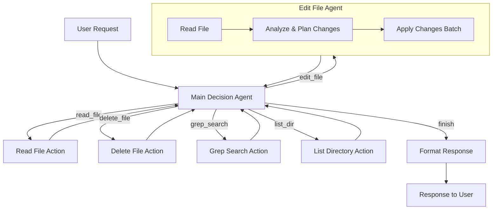

<h1 align="center">Pocket Flow Project Template: Agentic Coding</h1>

<p align="center">
  <a href="https://github.com/The-Pocket/PocketFlow" target="_blank">
    
  </a>
</p>

This is a project template for Agentic Coding with [Pocket Flow](https://github.com/The-Pocket/PocketFlow), a 100-line LLM framework, and your editor of choice.

- We have included the [.cursorrules](.cursorrules), [.clinerules](.clinerules), and [.windsurfrules](.windsurfrules) files to let Cursor AI (also Cline, or Windsurf) help you build LLM projects.
  
- Want to learn how to build LLM projects with Agentic Coding?

  - Check out the [Agentic Coding Guidance](https://the-pocket.github.io/PocketFlow/guide.html)
    
  - Check out the [YouTube Tutorial](https://www.youtube.com/@ZacharyLLM?sub_confirmation=1)

# Coding Agent - PocketFlow Implementation

A sophisticated coding assistant built with the PocketFlow framework that can read, edit, search, and manage files through natural language interactions.

## Features

The coding agent provides the following capabilities:

### 🔍 **File Operations**
- **Read Files**: Read and display content of any file in the workspace
- **Edit Files**: Modify files with intelligent line-by-line edits
- **Delete Files**: Remove files from the filesystem
- **Directory Listing**: Show directory structure with tree visualization

### 🔎 **Search Operations**  
- **Grep Search**: Search for text patterns across files with regex support
- **File Type Filtering**: Include/exclude specific file patterns
- **Case-sensitive Search**: Optional case-sensitive matching

### 🤖 **Intelligent Agent**
- **Multi-step Planning**: Breaks down complex requests into manageable steps
- **Context Awareness**: Maintains history of actions and learns from previous steps
- **Error Handling**: Graceful recovery from failures with detailed logging
- **Natural Language Interface**: Understands coding requests in plain English

## Architecture

### Design Pattern: Agent + Sub-Agent
- **Main Decision Agent**: Interprets user requests and selects appropriate tools
- **Edit File Agent**: Specialized 3-step editing process (Read → Analyze → Apply)

### Flow Structure


## Installation

1. **Install Dependencies**:
   ```bash
   uv pip install -r requirements.txt
   ```

2. **Set up Environment**:
   - Add your OpenAI API key to environment variables:
     ```bash
     export OPENAI_API_KEY="your-api-key-here"
     ```

## Usage

### CLI Mode (New!)
Execute single queries directly from the command line:
```bash
# Read a file
python main.py --query "Read the contents of README.md"

# Search for patterns
python main.py --query "Search for 'TODO' in Python files"

# List directory structure
python main.py --query "Show me the project structure"

# Edit files
python main.py --query "Add a comment to line 1 of main.py"

# Use different working directory
python main.py --query "List files" --working-dir /path/to/project

# Enable verbose logging
python main.py --query "Read package.json" --verbose

# Show help
python main.py --help
```

### CLI Options
```
usage: main.py [-h] [--query QUERY] [--working-dir WORKING_DIR] [--verbose]

Coding Agent - AI-powered file operations assistant

options:
  -h, --help            show this help message and exit
  --query QUERY, -q QUERY
                        The coding request to execute. If not provided, starts interactive mode.
  --working-dir WORKING_DIR, -w WORKING_DIR
                        Working directory for file operations. Defaults to current directory.
  --verbose, -v         Enable verbose logging output
```

### Interactive Mode
```bash
python main.py
```
If no `--query` is provided, starts interactive mode where you can enter multiple requests.

### Demo Mode
```bash
python demo.py
```

The demo includes three modes:
1. **Predefined demos** - Programmatic examples showcasing all capabilities
2. **Interactive mode** - Live interaction with the agent
3. **CLI usage demos** - Examples of command-line usage

### Example Interactions

**Read a file:**
```
User: "Read the contents of package.json"
Agent: Reads the file and displays its content
```

**Search for code:**
```
User: "Find all functions named 'handle' in JavaScript files"
Agent: Searches *.js files for 'handle' function definitions
```

**Edit files:**
```
User: "Add a new method called 'validate' to the User class in user.py"
Agent: Reads user.py → Plans the edit → Applies changes
```

**Explore codebase:**
```
User: "Show me the project structure"
Agent: Lists directories and files in a tree format
```

## Project Structure

```
├── main.py              # Main entry point
├── demo.py              # Demo script with examples
├── nodes.py             # All node implementations
├── flow.py              # Flow definitions and connections
├── utils/               # Utility functions
│   ├── call_llm.py      # LLM API integration
│   ├── read_file.py     # File reading utilities
│   ├── delete_file.py   # File deletion utilities
│   ├── replace_file.py  # File editing utilities
│   ├── search_ops.py    # Search operations
│   └── dir_ops.py       # Directory operations
├── docs/                # Documentation
└── requirements.txt     # Dependencies
```

## Logging

The agent provides comprehensive logging at multiple levels:

- **INFO**: Normal operations and decision flow
- **WARNING**: Non-critical issues (e.g., failed parsing)
- **ERROR**: Operation failures

Logs are written to:
- `coding_agent.log` (main usage)
- `coding_agent_demo.log` (demo mode)
- Console output

### Log Examples
```
2024-01-15 10:30:15 - MainDecisionAgent: Processing user query: 'Read README.md'
2024-01-15 10:30:16 - MainDecisionAgent: Selected tool 'read_file' with reason: Read the README file to understand the project
2024-01-15 10:30:16 - ReadFileAction: Successfully read file 'README.md' (2048 characters)
```

## Key Implementation Details

### Shared Memory Structure
```python
shared = {
    "user_query": str,           # Original user request
    "working_dir": str,          # Current working directory
    "history": [...],            # Action history with results
    "edit_operations": [...],    # Temporary edit plans
    "response": str              # Final response to user
}
```

### Error Handling
- **File Access**: Validates paths and permissions
- **LLM Parsing**: Fallback for malformed responses
- **Edit Conflicts**: Sorts edits to prevent line number conflicts
- **Tool Selection**: Validates tool names and parameters

### Security Features
- **Path Validation**: Prevents access outside working directory
- **Input Sanitization**: Validates file paths and parameters
- **Safe Defaults**: Conservative fallbacks for parsing failures

## Contributing

The coding agent is built following the PocketFlow "Agentic Coding" pattern:

1. **Human Design**: High-level flow and requirements
2. **Agent Implementation**: Detailed node logic and error handling
3. **Iterative Refinement**: Testing and optimization

See `docs/coding_agent_design_doc.md` for the complete design documentation.

## License

This project is part of the PocketFlow ecosystem. Please refer to the PocketFlow license.
